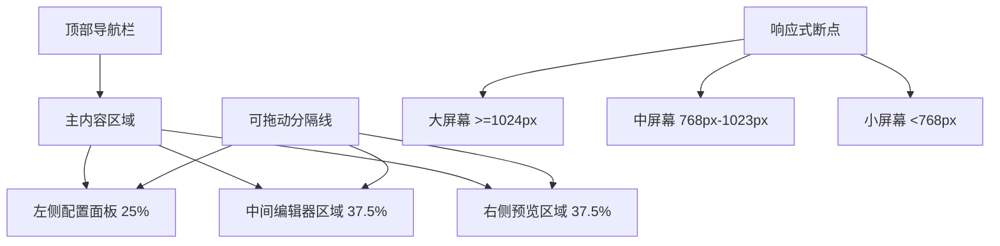
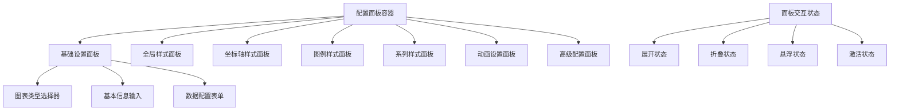

# ECharts 可视化配置平台 UI 设计方案

## 1. 整体布局架构图

### 当前布局分析
基于参考HTML文件和现有React应用，当前使用的是左右两栏布局：
- 左侧：配置区域（20%宽度）
- 右侧：编辑器和预览区域（80%宽度，可拖动调整）

### 推荐的三栏布局架构



### 响应式断点规划
1. **大屏幕 (≥1024px)**：三栏水平布局
   - 左侧配置面板：25%宽度，最小280px
   - 中间编辑器：37.5%宽度，最小400px
   - 右侧预览：37.5%宽度，最小400px

2. **中屏幕 (768px-1023px)**：两栏布局
   - 左侧配置面板：30%宽度，可折叠
   - 右侧内容区：70%宽度，编辑器和预览垂直堆叠

3. **小屏幕 (<768px)**：单栏布局
   - 全屏垂直堆叠：配置面板 → 编辑器 → 预览
   - 配置面板默认折叠，通过按钮展开

## 2. 视觉设计规范

### 颜色系统
```css
:root {
  /* 主色调 - 基于参考HTML的蓝色系 */
  --primary: 59, 130, 246;           /* #3b82f6 */
  --primary-foreground: 255, 255, 255;  /* #ffffff */
  
  /* 辅助色 */
  --secondary: 100, 116, 139;        /* #64748b */
  --secondary-foreground: 248, 250, 252; /* #f8fafc */
  
  /* 状态色 */
  --success: 34, 197, 94;          /* #22c55e */
  --warning: 245, 158, 11;         /* #f59e0b */
  --error: 239, 68, 68;           /* #ef4444 */
  --info: 139, 92, 246;           /* #8b5cf6 */
  
  /* 中性色 */
  --muted: 241, 245, 249;          /* #f1f5f9 */
  --muted-foreground: 100, 116, 139; /* #64748b */
  --border: 226, 232, 240;         /* #e2e8f0 */
  --background: 255, 255, 255;       /* #ffffff */
  --foreground: 30, 41, 59;          /* #1e293b */
  
  /* 图表专用色彩 */
  --chart-blue: 59, 130, 246;        /* #3b82f6 */
  --chart-purple: 139, 92, 246;       /* #8b5cf6 */
  --chart-green: 34, 197, 94;        /* #22c55e */
  --chart-amber: 245, 158, 11;        /* #f59e0b */
  --chart-red: 239, 68, 68;          /* #ef4444 */
}
```

### 字体系统
```css
:root {
  /* 字体族 */
  --font-sans: 'Inter', system-ui, sans-serif;
  --font-mono: 'JetBrains Mono', 'Fira Code', monospace;
  
  /* 字体大小 */
  --text-xs: 0.75rem;     /* 12px */
  --text-sm: 0.875rem;    /* 14px */
  --text-base: 1rem;      /* 16px */
  --text-lg: 1.125rem;    /* 18px */
  --text-xl: 1.25rem;     /* 20px */
  --text-2xl: 1.5rem;    /* 24px */
  --text-3xl: 1.875rem;  /* 30px */
  
  /* 字体粗细 */
  --font-light: 300;
  --font-normal: 400;
  --font-medium: 500;
  --font-semibold: 600;
  --font-bold: 700;
  
  /* 行高 */
  --leading-tight: 1.25;
  --leading-normal: 1.5;
  --leading-relaxed: 1.75;
}
```

### 间距系统
```css
:root {
  /* 基础间距单位 */
  --space-1: 0.25rem;   /* 4px */
  --space-2: 0.5rem;    /* 8px */
  --space-3: 0.75rem;   /* 12px */
  --space-4: 1rem;      /* 16px */
  --space-5: 1.25rem;   /* 20px */
  --space-6: 1.5rem;    /* 24px */
  --space-8: 2rem;      /* 32px */
  --space-10: 2.5rem;   /* 40px */
  --space-12: 3rem;     /* 48px */
  --space-16: 4rem;     /* 64px */
  
  /* 组件特定间距 */
  --card-padding: 1.5rem;      /* 24px */
  --panel-gap: 1rem;          /* 16px */
  --form-gap: 0.75rem;        /* 12px */
  --button-gap: 0.5rem;       /* 8px */
}
```

### 阴影和边框规范
```css
:root {
  /* 阴影层级 */
  --shadow-sm: 0 1px 2px 0 rgb(0 0 0 / 0.05);
  --shadow-md: 0 4px 6px -1px rgb(0 0 0 / 0.1), 0 2px 4px -2px rgb(0 0 0 / 0.06);
  --shadow-lg: 0 10px 15px -3px rgb(0 0 0 / 0.1), 0 4px 6px -4px rgb(0 0 0 / 0.05);
  --shadow-xl: 0 20px 25px -5px rgb(0 0 0 / 0.1), 0 8px 10px -6px rgb(0 0 0 / 0.05);
  
  /* 边框半径 */
  --radius-sm: 0.375rem;   /* 6px */
  --radius-md: 0.5rem;     /* 8px */
  --radius-lg: 0.75rem;    /* 12px */
  --radius-xl: 1rem;       /* 16px */
  --radius-full: 9999px;
  
  /* 边框宽度 */
  --border-width: 1px;
  --border-width-2: 2px;
}
```

## 3. 配置面板设计方案

### 折叠面板架构
基于参考HTML文件的折叠面板设计，改进为更直观的交互：



### 面板设计规范
1. **面板头部**
   - 高度：48px
   - 背景：渐变色 `from-gray-50 to-gray-100`
   - 边框：底部 1px `border-gray-200`
   - 圆角：顶部 `rounded-t-lg`，底部 `rounded-t-none`
   - 内边距：`px-4 py-3`
   - 图标：左侧，颜色 `text-primary`
   - 标题：字体 `font-medium text-sm`
   - 折叠指示器：右侧，带旋转动画

2. **面板内容**
   - 内边距：`p-4`
   - 背景：`bg-white`
   - 过渡动画：`transition-all duration-300 ease-in-out`
   - 最大高度：展开时 `max-h-96`，折叠时 `max-h-0`
   - 溢出：`overflow-hidden`

3. **表单控件设计**
   - 输入框：高度 `h-8`，圆角 `rounded-md`，边框 `border-gray-300`
   - 选择器：高度 `h-8`，与输入框保持一致
   - 颜色选择器：圆形 `rounded-full`，尺寸 `w-10 h-10`
   - 复选框：自定义样式，带动画效果

## 4. 组件库和交互状态规范

### 按钮组件
```css
/* 基础按钮 */
.btn-base {
  @apply px-4 py-2 rounded-md font-medium text-sm transition-all duration-200;
  @apply focus:outline-none focus:ring-2 focus:ring-offset-2;
}

/* 主要按钮 */
.btn-primary {
  @apply bg-primary text-primary-foreground hover:bg-primary/90;
  @apply focus:ring-primary;
}

/* 次要按钮 */
.btn-secondary {
  @apply bg-secondary text-secondary-foreground hover:bg-secondary/80;
  @apply focus:ring-secondary;
}

/* 轮廓按钮 */
.btn-outline {
  @apply border border-input bg-background hover:bg-accent hover:text-accent-foreground;
  @apply focus:ring-ring;
}

/* 幽灵按钮 */
.btn-ghost {
  @apply hover:bg-accent hover:text-accent-foreground;
  @apply focus:ring-ring;
}

/* 按钮尺寸 */
.btn-sm {
  @apply h-8 px-3 text-xs;
}

.btn-md {
  @apply h-10 px-4 py-2 text-sm;
}

.btn-lg {
  @apply h-12 px-8 text-base;
}
```

### 交互状态
1. **悬停状态**
   - 按钮：亮度变化 `hover:brightness-110`
   - 卡片：阴影增强 `hover:shadow-lg`
   - 输入框：边框颜色变化 `hover:border-primary`
   - 面板：背景轻微变化 `hover:bg-gray-50`

2. **激活状态**
   - 按钮：背景加深 `bg-primary/80`
   - 标签页：下划线 `border-b-2 border-primary`
   - 面板：高亮边框 `border-l-4 border-primary`

3. **焦点状态**
   - 所有可交互元素：环形高亮 `ring-2 ring-primary ring-offset-2`
   - 输入框：边框颜色 `border-primary`
   - 跳转链接：轮廓 `outline-2 outline-primary`

4. **禁用状态**
   - 按钮：透明度降低 `opacity-50 cursor-not-allowed`
   - 输入框：背景变灰 `bg-gray-100`
   - 交互元素：指针事件禁用 `pointer-events-none`

## 5. 动画和过渡效果规范

### 过渡时长
```css
:root {
  --transition-fast: 150ms;
  --transition-normal: 300ms;
  --transition-slow: 500ms;
  
  --ease-in: cubic-bezier(0.4, 0, 1, 1);
  --ease-out: cubic-bezier(0, 0, 0.2, 1);
  --ease-in-out: cubic-bezier(0.4, 0, 0.2, 1);
}
```

### 动画效果
1. **淡入淡出**
   ```css
   .fade-in {
     animation: fadeIn var(--transition-normal) var(--ease-out);
   }
   
   @keyframes fadeIn {
     from { opacity: 0; transform: translateY(10px); }
     to { opacity: 1; transform: translateY(0); }
   }
   ```

2. **滑动效果**
   ```css
   .slide-down {
     animation: slideDown var(--transition-normal) var(--ease-out);
   }
   
   @keyframes slideDown {
     from { max-height: 0; opacity: 0; }
     to { max-height: 500px; opacity: 1; }
   }
   ```

3. **缩放效果**
   ```css
   .scale-up {
     animation: scaleUp var(--transition-fast) var(--ease-out);
   }
   
   @keyframes scaleUp {
     from { transform: scale(0.95); opacity: 0; }
     to { transform: scale(1); opacity: 1; }
   }
   ```

4. **按钮波纹效果**
   ```css
   .btn-ripple {
     position: relative;
     overflow: hidden;
   }
   
   .btn-ripple::after {
     content: '';
     position: absolute;
     top: 50%;
     left: 50%;
     width: 0;
     height: 0;
     background: rgba(255, 255, 255, 0.2);
     border-radius: 50%;
     transform: translate(-50%, -50%);
     transition: width 0.6s, height 0.6s;
   }
   
   .btn-ripple:active::after {
     width: 300px;
     height: 300px;
   }
   ```

## 6. 实现策略和组件重构优先级

### 第一阶段：基础架构重构
1. **创建设计系统文件**
   - `frontend/src/styles/design-tokens.css` - 设计令牌
   - `frontend/src/styles/components.css` - 基础组件样式
   - `frontend/src/styles/animations.css` - 动画效果

2. **更新Tailwind配置**
   - 扩展颜色系统
   - 添加自定义字体
   - 配置动画时长

### 第二阶段：核心组件重构
1. **配置面板组件** (`ConfigPanel.tsx`)
   - 折叠面板基础组件
   - 表单控件组件
   - 面板头部组件

2. **布局管理器** (`LayoutManager.tsx`)
   - 响应式布局逻辑
   - 拖拽调整大小功能
   - 面板切换功能

3. **导航栏组件** (`TopNavigation.tsx`)
   - 应用标题
   - 操作按钮组
   - 用户菜单

### 第三阶段：高级功能
1. **主题系统**
   - 明暗主题切换
   - 自定义主题色
   - 主题持久化

2. **交互增强**
   - 键盘快捷键
   - 拖拽排序
   - 批量操作

## 7. 样式系统组织方式

### 文件结构
```
frontend/src/
├── styles/
│   ├── design-tokens.css      # 设计令牌和变量
│   ├── base.css             # 基础样式重置
│   ├── components.css        # 组件样式
│   ├── utilities.css        # 工具类
│   └── animations.css        # 动画效果
├── components/
│   ├── ui/                 # 基础UI组件
│   │   ├── Button.tsx
│   │   ├── Input.tsx
│   │   ├── Select.tsx
│   │   ├── Card.tsx
│   │   ├── Tabs.tsx
│   │   └── index.ts
│   ├── layout/             # 布局组件
│   │   ├── TopNavigation.tsx
│   │   ├── ConfigPanel.tsx
│   │   ├── EditorPanel.tsx
│   │   ├── PreviewPanel.tsx
│   │   └── index.ts
│   └── chart/              # 图表相关组件
│       ├── ChartRenderer.tsx
│       ├── ChartControls.tsx
│       └── index.ts
└── hooks/
    ├── useTheme.ts          # 主题管理
    ├── useResponsive.ts      # 响应式状态
    └── useConfigPanel.ts    # 配置面板状态
```

### 集成方案
1. **CSS变量系统**
   - 使用CSS自定义属性定义设计令牌
   - 支持主题切换和动态更新
   - 保持与Tailwind的兼容性

2. **组件组合模式**
   - 基础组件提供核心功能
   - 复合组件处理复杂交互
   - 保持API的一致性

3. **样式隔离**
   - 使用CSS模块或样式组件
   - 避免全局样式污染
   - 支持主题切换

## 8. 性能优化考虑

### 渲染优化
1. **虚拟滚动**
   - 大型配置列表使用虚拟滚动
   - 减少DOM节点数量
   - 提升滚动性能

2. **懒加载**
   - 非活动面板延迟渲染
   - 图片和复杂组件按需加载
   - 减少初始渲染时间

3. **状态管理优化**
   - 使用useMemo减少重渲染
   - 合理使用useCallback
   - 避免不必要的状态更新

### 交互优化
1. **防抖处理**
   - 输入框使用防抖
   - 配置变更延迟处理
   - 减少频繁更新

2. **批量更新**
   - 配置变更批量处理
   - 减少渲染次数
   - 提升响应速度

## 总结

本设计方案基于参考HTML文件的现代化设计理念，结合当前React应用的技术栈，提供了一个全面的UI改进方案。重点改进了配置面板的用户体验，同时保持了与现有功能的兼容性。通过模块化的设计系统和组件化的实现方式，确保了代码的可维护性和扩展性。